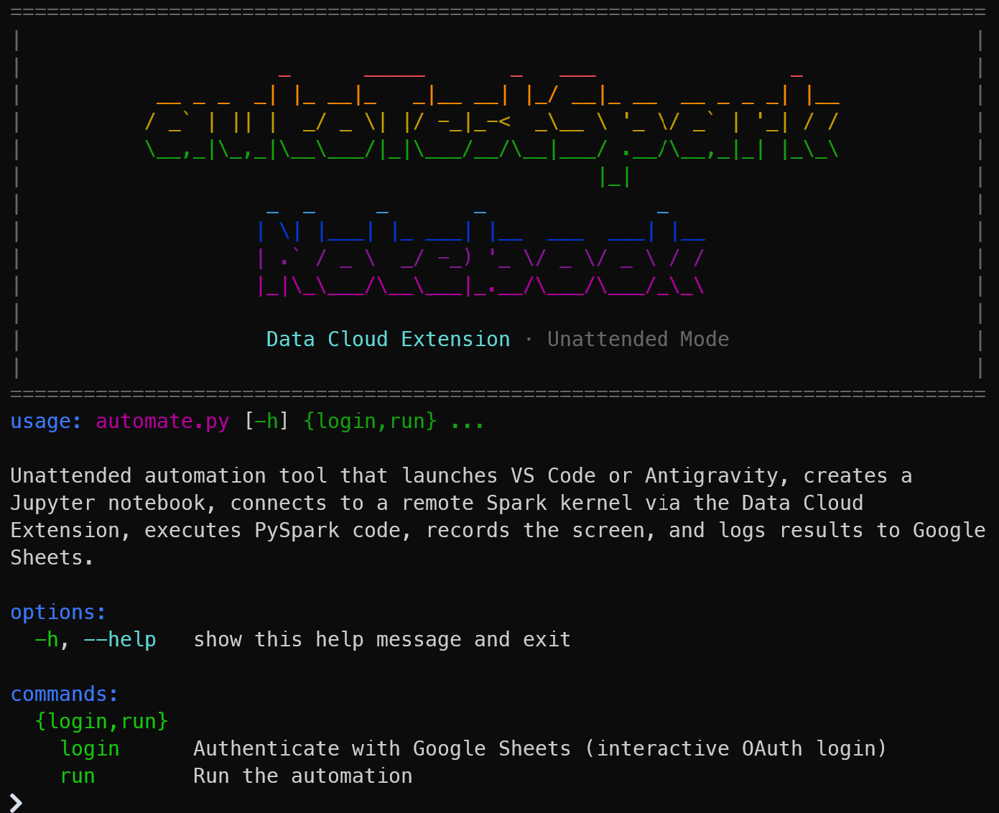

# autoTestSparkNotebook



Cross-platform automated testing of PySpark notebook execution via the Data Cloud Extension in VS Code and Antigravity (a VS Code fork). Launches the IDE, creates a Jupyter notebook, connects to a remote Spark kernel provided by Data Cloud Extension, runs PySpark code, and records the screen -- all unattended.

Supports **Windows**, **macOS**, and **Linux**.

## Prerequisites

- **Python 3.10+**
- **ffmpeg**:
  - Windows: `winget install Gyan.FFmpeg`
  - macOS: `brew install ffmpeg`
  - Linux: `sudo apt install ffmpeg`
- **VS Code** and/or **Antigravity** on PATH (`code` / `antigravity`), with the **Data Cloud Extension** installed
- **Playwright** -- `pip install playwright && playwright install chromium`

Install Python dependencies:

```bash
pip install pyautogui pyperclip playwright gspread google-auth google-auth-oauthlib google-genai
```

## Usage

### Basic run (VS Code, single iteration)

```bash
python automate.py run
```

### Run with Antigravity, 9 iterations

```bash
python automate.py run --app antigravity -n 9
```

### Loop forever (grid video every 9 runs)

```bash
python automate.py run --app antigravity --loop
```

Press `Ctrl+C` to stop gracefully. A summary of any remaining runs in the current batch is printed on exit.

### All options

| Flag | Default | Description |
|------|---------|-------------|
| `--app {vscode,antigravity}` | `vscode` | Which IDE to automate |
| `-n N` | `1` | Number of runs |
| `--loop` | off | Run forever, building a grid video every 9 runs |
| `--output-dir DIR` | `output` | Output directory for recordings and history |
Running with no arguments displays the banner and help. Use `run` or `login` to start.

## What it does

1. Kills any existing IDE instance and launches a fresh one with `--remote-debugging-port=9222`
2. Connects via Chrome DevTools Protocol using Playwright
3. Creates a new Jupyter notebook via the command palette
4. Pastes PySpark sample code into the cell
5. Saves the notebook to a known path
6. Opens the kernel picker, selects the Remote Spark Kernel (provided by Data Cloud Extension)
7. Waits for the kernel to connect
8. Runs all cells
9. Polls the saved `.ipynb` file for a completion marker or error
10. Records the screen throughout via ffmpeg

Each run produces a screen recording. After a batch completes (or every 9 runs in `--loop` mode), recordings are combined into a 3x3 grid video.

## Output

Recordings are organized into date-based folders:

```
output/
  history.txt
  2026-04-01/
    recording_1.mp4
    recording_2.mp4
    ...
    20260401_152732_antigravity_9runs.mp4
  2026-04-02/
    ...
```

### Results history

After each run, a tab-separated row is appended to `output/history.txt`:

```
Date    Time    IDE    Status    Cell Execution Time (s)    Total Time (s)    Recording    Failure Summary
```

This file is designed to be copy-pasted directly into Google Sheets.

### Google Sheets integration

To also push results to a Google Sheet in real time:

1. Go to [Google Cloud Console > Credentials](https://console.cloud.google.com/apis/credentials)
2. Create an **OAuth 2.0 Client ID** (application type: Desktop)
3. Download the JSON and save it as `credentials.json` in the project root
4. Enable the **Google Sheets API** in your project
5. Copy `config.example.json` to `config.json` and fill in your values:
   ```json
   {
     "sheet_id": "YOUR_GOOGLE_SHEET_ID_HERE",
     "gemini_api_key": "YOUR_GEMINI_API_KEY_HERE"
   }
   ```
6. Run the login command once (opens a browser for Google login):
   ```bash
   python automate.py login
   ```
7. Run as usual — results are pushed automatically when `sheet_id` is present in the config:
   ```bash
   python automate.py run --app antigravity --loop
   ```

The token is cached in `token.json` and refreshed automatically. If the token is missing or invalid when `sheet_id` is configured, the script will exit with an error prompting you to run `login` again. `config.json`, `credentials.json`, and `token.json` are all gitignored.

### Failure analysis

When `gemini_api_key` is set in `config.json`, failed runs are automatically analyzed: the Jupyter server log is sent to Gemini, which returns a short summary (150 chars max) of what went wrong. This summary appears in the console output, `history.txt`, and Google Sheets.

## Sleep prevention

The script prevents the system from sleeping during automation and restores normal behavior on exit:

- **Windows**: `SetThreadExecutionState` API
- **macOS**: `caffeinate` subprocess
- **Linux**: `xset -dpms`
